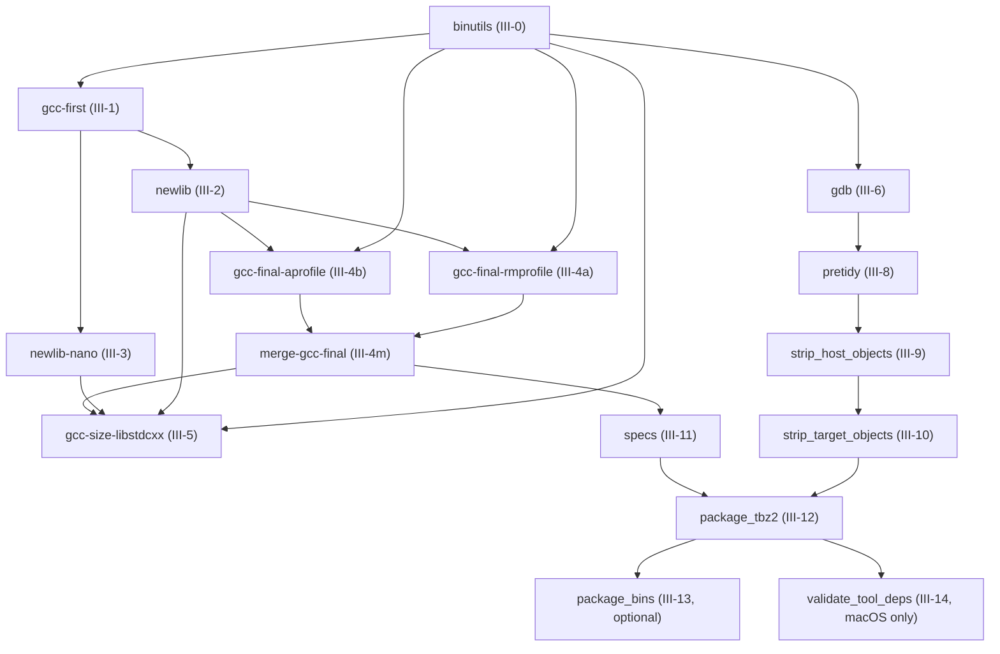

# Build Stages Reference

This document maps each native build stage in `build-toolchain.sh` to its
source directory inputs, declared dependencies on prior stages, and the subset
of `install-native/` it creates or modifies.

## Summary

| Stage ID | Task label | Source directory | Depends on |
| --- | --- | --- | --- |
| `binutils` | III-0 | `src/binutils/` | — |
| `gcc-first` | III-1 | `src/gcc/` | `binutils` |
| `newlib` | III-2 | `src/newlib/` | `gcc-first` |
| `newlib-nano` | III-3 | `src/newlib/` | `gcc-first` |
| `gcc-final-rmprofile` | III-4a | `src/gcc/` | `binutils`, `newlib` |
| `gcc-final-aprofile` | III-4b | `src/gcc/` | `binutils`, `newlib` |
| `merge-gcc-final` | III-4m | — | `gcc-final-rmprofile`, `gcc-final-aprofile` |
| `gcc-size-libstdcxx` | III-5 | `src/gcc/` | `binutils`, `newlib`, `newlib-nano`, `merge-gcc-final` |
| `gdb` | III-6 | `src/gdb/` | `binutils` |
| `pretidy` | III-8 | — | `gdb` |
| `strip_host_objects` | III-9 | — | `pretidy` |
| `strip_target_objects` | III-10 | — | `strip_host_objects` |
| `specs` | III-11 | `src/specs/` | `merge-gcc-final` |
| `package_tbz2` | III-12 | `license.txt` | `strip_target_objects`, `specs` |
| `package_bins` | III-13 | — | `package_tbz2` |
| `validate_tool_deps` | III-14 | — | `package_tbz2` (macOS only) |

---

## Stage Detail

### III-0 — `binutils`

**Source directory:** `src/binutils/`

**Description:** Configures and builds the cross-assembler, linker, and binary
utilities (`as`, `ld`, `ar`, `nm`, `objcopy`, `objdump`, `readelf`, `strip`,
etc.) for the `arm-none-eabi` target. Installs to `install-native/`. After
installation the initial `install-native/lib/` directory is removed (it
contains only static host libraries that are not needed in the final
toolchain).

A copy of `install-native/` is taken immediately after this stage into
`build-native/target-libs/` so that subsequent stages that need a plain
sysroot can reference it without polluting the live installation.

**Depends on:** nothing — this is the first stage.

**Artifacts written to `install-native/`:**

| Path | Contents |
| --- | --- |
| `bin/arm-none-eabi-as` | Cross-assembler |
| `bin/arm-none-eabi-ld` | Cross-linker |
| `bin/arm-none-eabi-ar` | Archive manager |
| `bin/arm-none-eabi-nm` | Symbol lister |
| `bin/arm-none-eabi-objcopy` | Binary converter |
| `bin/arm-none-eabi-objdump` | Disassembler/inspector |
| `bin/arm-none-eabi-ranlib` | Archive index generator |
| `bin/arm-none-eabi-readelf` | ELF inspector |
| `bin/arm-none-eabi-strip` | Debug-info stripper |
| `bin/arm-none-eabi-size` | Section-size reporter |
| `bin/arm-none-eabi-strings` | String extractor |
| `arm-none-eabi/bin/` | Hard-linked copies of the cross tools |
| `share/doc/gcc-arm-none-eabi/` | HTML/PDF/man/info documentation (unless `--skip_steps=manual`) |

---

### III-1 — `gcc-first`

**Source directory:** `src/gcc/`

**Description:** Builds a minimal C-only cross-compiler (no target libraries,
no C++ support). This first-pass compiler is just enough to compile newlib in
the next stages. Only `all-gcc` and `install-gcc` are invoked — the target
runtime libraries (`libgcc`, `libstdc++`, etc.) are not yet built.

**Depends on:**
- `binutils` — `install-native/bin/arm-none-eabi-as` and
  `install-native/bin/arm-none-eabi-ld` must already be present (GCC
  configure detects them via `--with-gnu-as`/`--with-gnu-ld` and the sysroot
  `--with-sysroot=$INSTALLDIR_NATIVE/arm-none-eabi`).

**Artifacts written to `install-native/`:**

| Path | Contents |
| --- | --- |
| `bin/arm-none-eabi-gcc` | Minimal C cross-compiler |
| `bin/arm-none-eabi-cpp` | C pre-processor |
| `bin/arm-none-eabi-gcc-<ver>` | Versioned compiler alias |
| `lib/gcc/arm-none-eabi/<ver>/` | Compiler support files (`cc1`, `collect2`, `lto1`, `lto-wrapper`, spec files) |

**Artifacts deleted from `install-native/`:**

| Action | Path |
| --- | --- |
| Deleted | `bin/arm-none-eabi-gccbug` |
| Deleted | `lib/libiberty.a` |
| Deleted | `include/` (top-level GCC host include tree) |

---

### III-2 — `newlib`

**Source directory:** `src/newlib/`

**Description:** Builds the standard newlib C library and math library for all
multilibs (`rmprofile,aprofile` by default). Compiled with size-and-debug
optimisations (`-g -Os -ffunction-sections -fdata-sections ...
-DPREFER_SIZE_OVER_SPEED -D__OPTIMIZE_SIZE__ -DSMALL_MEMORY`). Installs
headers and pre-built archives directly into `install-native/arm-none-eabi/`.

**Depends on:**
- `gcc-first` — `install-native/bin/arm-none-eabi-gcc` is prepended to `PATH`
  so configure and make can find the cross-compiler.

**Artifacts written to `install-native/`:**

| Path | Contents |
| --- | --- |
| `arm-none-eabi/include/` | newlib public headers (`stdio.h`, `stdlib.h`, `string.h`, `sys/`, etc.) |
| `arm-none-eabi/lib/` | `libc.a`, `libm.a`, `libg.a`, `librdimon.a`, `librdimon-v2m.a`, `libnosys.a`, `nosys.specs`, `rdimon.specs`, `nano.specs`, per-multilib `*.o` (crt0) |
| `share/doc/gcc-arm-none-eabi/` | libc/libm PDF and HTML documentation (unless `--skip_steps=manual`) |

---

### III-3 — `newlib-nano`

**Source directory:** `src/newlib/`

**Description:** Builds a second, more-aggressively-minimised variant of
newlib (nano configuration: `--enable-newlib-nano-malloc`,
`--enable-newlib-nano-formatted-io`, `--enable-lite-exit`, etc.). This variant
is **not** installed to `install-native/` directly; it is installed into the
intermediate staging directory `build-native/target-libs/` so that the later
`gcc-size-libstdcxx` stage can build nano-configured libstdc++ against it.

**Depends on:**
- `gcc-first` — same as `newlib`, the cross-compiler must be on `PATH`.

**Artifacts written to `build-native/target-libs/` (staging only):**

| Path | Contents |
| --- | --- |
| `arm-none-eabi/lib/` | Nano `libc.a`, `libm.a`, `libg.a`, `librdimon.a`, `librdimon-v2m.a`, per-multilib `nano.specs`, `rdimon.specs`, `nosys.specs`, `*crt0.o` |
| `arm-none-eabi/include/` | Full newlib-nano header tree; `newlib.h` within this tree is the nano-configured newlib feature header later copied to `install-native/` |

> **Note:** `install-native/` is **not** modified by this stage. The nano
> artifacts reach `install-native/` only after stage III-5 (`gcc-size-libstdcxx`)
> via `copy_multi_libs` and a direct header copy.

---

### III-4a — `gcc-final-rmprofile`

**Source directory:** `src/gcc/`

**Description:** Builds the full C and C++ cross-compiler, including all
target-side runtime libraries (`libgcc`, `libstdc++`, `libsupc++`, etc.) for
the `rmprofile` multilib group: 20 M-profile Cortex-M variants covering
`v6-m`, `v7-m`, `v7e-m`, `v8-m.base`, `v8-m.main`, and `v8.1-m.main` (with
fp/dp/mve/pacbti sub-variants) plus 8 base variants shared with all profiles.

This stage is run in parallel with III-4b (`gcc-final-aprofile`) in CI builds
to reduce the cold-cache critical path. Invoked as
`build-gcc-final.sh --with-multilib-list=rmprofile`.

In local sequential builds (via `build-toolchain.sh`) both multilib groups
are built together in a single `build-gcc-final.sh` invocation using the
default `--with-multilib-list=rmprofile,aprofile`.

> See [`docs/multilib-variants.md`](multilib-variants.md) for the complete
> catalog of all rmprofile library paths and their make-variable forms.

**Depends on:**
- `binutils` — cross tools (`as`, `ld`, …) must be in `install-native/bin/`.
- `newlib` — target headers and libraries must be in
  `install-native/arm-none-eabi/` (referenced via
  `--with-sysroot=$INSTALLDIR_NATIVE/arm-none-eabi`).

**Artifacts written to staging directory (CI) / `install-native/` (local):**

> **CI staging:** In CI, each parallel build job writes its output to
> `install-native/` on the runner, then saves that directory as a
> profile-specific GitHub Actions cache (key:
> `stage-v3-<gcc-final-rmprofile-hash>`).  The III-4m (`merge-gcc-final`)
> step later restores both profile caches and re-saves them merged under the
> shared `stage-v3-<gcc-final-hash>` key used by downstream stages.  In local
> sequential builds both profiles write directly to `install-native/` with no
> separate cache or merge step.

| Path | Contents |
| --- | --- |
| `bin/arm-none-eabi-gcc` | Full C cross-compiler (replaces gcc-first version) |
| `bin/arm-none-eabi-g++` | C++ cross-compiler |
| `bin/arm-none-eabi-gcov` | Coverage tool |
| `bin/arm-none-eabi-gcov-dump` | Coverage dump tool |
| `bin/arm-none-eabi-gcov-tool` | Coverage merge tool |
| `bin/arm-none-eabi-lto-dump` | LTO dump tool |
| `lib/gcc/arm-none-eabi/<ver>/` | Updated compiler support files plus `libgcc.a`, rmprofile + base multilib-specific archives and `*.o` |
| `arm-none-eabi/lib/` | `libstdc++.a`, `libsupc++.a`, rmprofile + base per-multilib variants |
| `arm-none-eabi/include/c++/` | C++ standard-library headers |
| `share/doc/gcc-arm-none-eabi/` | GCC HTML/PDF documentation (unless `--skip_steps=manual`) |

**Artifacts deleted from staging / `install-native/`:**

| Action | Path |
| --- | --- |
| Deleted | `bin/arm-none-eabi-gccbug` |
| Deleted | `arm-none-eabi/lib/**/libiberty.a` (all libiberty copies under arm-none-eabi/lib) |
| Deleted | `lib/libiberty.a` |
| Deleted | `include/` (top-level GCC host include tree) |
| Removed | `arm-none-eabi/usr` symlink (temporary symlink created at stage start) |

> **Note:** The `multilib.h` header in this output encodes only the `rmprofile`
> multilib set and is therefore incomplete. It must not be used directly — the
> correct combined `multilib.h` is regenerated in stage III-4m (`merge-gcc-final`).

---

### III-4b — `gcc-final-aprofile`

**Source directory:** `src/gcc/`

**Description:** Builds the full C and C++ cross-compiler runtime libraries
for the `aprofile` multilib group: 10 A-profile Cortex-A variants covering
`v7-a`, `v7ve+simd`, and `v8-a` (with fp/simd sub-variants) plus 8 base
variants shared with all profiles.

This stage runs in parallel with III-4a (`gcc-final-rmprofile`) in CI builds.
Invoked as `build-gcc-final.sh --with-multilib-list=aprofile`.

The `rmprofile` and `aprofile` output trees are disjoint — rmprofile covers
M-profile architectures (`v6-m`…`v8.1-m.main+pacbti+mve`) while aprofile
covers A-profile architectures (`v7-a`…`v8-a+simd`). No library path appears
in both sets, so the two builds can run independently and be safely merged.

> See [`docs/multilib-variants.md`](multilib-variants.md) for the complete
> catalog of all aprofile library paths and disjointness confirmation.

**Depends on:** same as III-4a.

**Artifacts written to staging directory (CI) / `install-native/` (local):**
Same as III-4a (see CI staging note above) but for `aprofile` + base multilib
subdirectories; saved under a separate `stage-v3-<gcc-final-aprofile-hash>` cache key.

> **Note:** The `multilib.h` header in this output encodes only the `aprofile`
> multilib set and is therefore incomplete. It must not be used directly — the
> correct combined `multilib.h` is regenerated in stage III-4m (`merge-gcc-final`).

---

### III-4m — `merge-gcc-final`

**Source directory:** none (CI merge step only)

**Description:** Combines the outputs of III-4a (`gcc-final-rmprofile`) and
III-4b (`gcc-final-aprofile`) into a single unified `install-native/` tree.
Because the two profile output trees are disjoint, the merge is performed by
layering the aprofile cache on top of the rmprofile cache and saving the
result under the shared `gcc-final` cache key used by downstream stages.

This is a CI-only convergence step. In local sequential builds via
`build-toolchain.sh`, both profiles are built together in a single
`build-gcc-final.sh` invocation (no merge step is needed).

**Merge procedure** (as implemented in `merge-gcc-final.sh`):

1. **Base:** Copy the rmprofile `install-native/` tree verbatim to the output
   directory. This tree contains the compiler binary, all shared headers
   (`arm-none-eabi/include/`, `arm-none-eabi/include/c++/`), the rmprofile
   multilib library directories, and the base multilib variants shared with
   all profiles.

2. **Overlay:** Overlay only the aprofile-specific multilib library
   directories from the aprofile tree. The directories overlaid are the
   immediate children of `arm-none-eabi/lib/thumb/` whose names match the
   `MULTI_ARCH_DIRS_A` patterns in `gcc/config/arm/t-aprofile`:
   `v7-a*`, `v7ve*`, `v8-a*`. Compiler binaries, headers, and host libraries
   from the aprofile tree are deliberately **not** overlaid.

3. **`multilib.h` regeneration:** The `multilib.h` header
   (`lib/gcc/arm-none-eabi/<ver>/plugin/include/multilib.h`) encodes the
   multilib configuration baked in at configure time; it differs between the
   two single-profile trees and cannot simply be overlaid. After merging the
   libraries, `merge-gcc-final.sh` regenerates a combined `multilib.h` by
   invoking `make s-mlib TM_MULTILIB_CONFIG="rmprofile,aprofile"` inside the
   existing rmprofile `gcc-final` build directory
   (`build-native/gcc-final/`). The `gcc/multilib.h` produced by that
   target is then copied over the installed copy in the output tree. If the
   build directory is absent (e.g. when running outside a full build
   environment), the step is skipped with a warning and the rmprofile
   `multilib.h` — which is valid but incomplete — is left in place.

4. **Verification:** `arm-none-eabi-gcc --print-multi-lib` is run against the
   merged tree to confirm that a representative rmprofile variant
   (`thumb/v7e-m+fp/hard`) is reported, and the aprofile library directories
   (`v7-a*`/`v7ve*`/`v8-a*` under `arm-none-eabi/lib/thumb/`) are checked
   to exist on disk.

**Output:** A `install-native/` tree equivalent to a full
`--with-multilib-list=rmprofile,aprofile` build.

**Depends on:**
- `gcc-final-rmprofile` (III-4a)
- `gcc-final-aprofile` (III-4b)

**Artifacts written to `install-native/`:**

Combined superset of III-4a and III-4b artifacts (see those sections for the
full artifact list), with `multilib.h` regenerated for the combined profile set.

---

### III-5 — `gcc-size-libstdcxx`

**Source directory:** `src/gcc/`

**Description:** Builds a size-optimised (`-Os -fno-exceptions`) variant of
`libstdc++` and `libsupc++` against the nano-configured newlib (from
`build-native/target-libs/`). The resulting `_nano` archives and specs files
are then **merged into `install-native/`** via `copy_multi_libs`, and the
nano-specific `newlib.h` header is copied to
`install-native/arm-none-eabi/include/newlib-nano/`.

**Depends on:**
- `binutils` — the cross-tools in `build-native/target-libs/bin/` (populated by the
  `copy_dir` call immediately after the binutils install at stage III-0) are used both
  by GCC configure (`--with-gnu-as`/`--with-gnu-ld`) and by `copy_multi_libs` (via its
  `target_gcc` argument).
- `newlib` — `install-native/arm-none-eabi/lib/` multilib directory structure must
  already exist for `copy_multi_libs` to copy the `_nano` archives into the correct
  per-multilib subdirectories.
- `newlib-nano` — `build-native/target-libs/arm-none-eabi/` must contain the nano
  newlib headers and libraries (the sysroot for the build).
- `merge-gcc-final` (III-4m) — the merged output from III-4a and III-4b
  containing the full GCC compiler and runtime libraries must be present in
  `install-native/` before this stage runs.

**Artifacts written to `install-native/`:**

| Path | Contents |
| --- | --- |
| `arm-none-eabi/lib/` (per multilib) | `libstdc++_nano.a`, `libsupc++_nano.a`, `libc_nano.a`, `libg_nano.a`, `librdimon_nano.a`, `librdimon-v2m_nano.a`, `nano.specs`, `rdimon.specs`, `nosys.specs`, `*crt0.o` |
| `arm-none-eabi/include/newlib-nano/newlib.h` | Nano-configured newlib feature header |

---

### III-6 — `gdb`

**Source directory:** `src/gdb/`

**Description:** Builds the `arm-none-eabi-gdb` debugger. For native
(non-PPA) builds, only the no-Python variant is produced: `skip_gdb_with_python`
is initialised to `yes` and there is no command-line option that sets it to
`no`, so the Python-enabled `arm-none-eabi-gdb-py` build path in
`build-toolchain.sh` (guarded by the `skip_gdb_with_python` check) is currently
unreachable. (For PPA builds, GDB is instead compiled with `--with-python=python3`
into the single `arm-none-eabi-gdb` binary.)

**Depends on:**
- `binutils` — GDB reuses the `install-native/` prefix and target layout
  established by the binutils stage.

**Artifacts written to `install-native/`:**

| Path | Contents |
| --- | --- |
| `bin/arm-none-eabi-gdb` | Cross-debugger (no Python) |
| `arm-none-eabi/share/gdb/` | GDB data directory (pretty-printers, architecture XML) |
| `share/doc/gcc-arm-none-eabi/` | GDB HTML/PDF documentation (unless `--skip_steps=manual`) |

---

### III-8 — `pretidy`

**Source directory:** none (post-install cleanup)

**Description:** Removes files that should not be in the final toolchain
package: `install-native/lib/libiberty.a` and all `*.la` libtool archive files
anywhere under `install-native/`.

**Depends on:** `gdb` (all compilation stages are complete before this runs).

**Artifacts modified in `install-native/`:**

| Action | Path |
| --- | --- |
| Deleted | `lib/libiberty.a` |
| Deleted | All `**/*.la` files |

---

### III-9 — `strip_host_objects`

**Source directory:** none (post-install cleanup)

**Description:** Strips debug symbols from host-native ELF/PE/Mach-O
executables to reduce package size (skipped for debug builds, i.e., whenever
`--build_type` includes `debug`).

**Depends on:** `pretidy` (III-8).

**Artifacts modified in `install-native/`:**

| Action | Path |
| --- | --- |
| Stripped | `bin/arm-none-eabi-*` (all host executables) |
| Stripped | `arm-none-eabi/bin/*` (hard-linked copies) |
| Stripped | `lib/gcc/arm-none-eabi/<ver>/` executables (`cc1`, `lto1`, etc.) |

---

### III-10 — `strip_target_objects`

**Source directory:** none (post-install cleanup)

**Description:** Strips debug info (`.comment`, `.note` sections, debug
symbols) from target-side static libraries and object files using
`arm-none-eabi-strip`. The `libg.a` and `libg_nano.a` debug archives are
exempt (they intentionally contain debug info); before stripping the other
target libraries, any hard links that point to these debug archives are
broken so they cannot be modified via aliasing. Skipped when
`--skip_steps=strip` is passed.

**Depends on:** `strip_host_objects` (III-9).

**Artifacts modified in `install-native/`:**

| Action | Path |
| --- | --- |
| Stripped | `arm-none-eabi/lib/**/*.a` (except `libg.a`, `libg_nano.a`) |
| Stripped | `arm-none-eabi/lib/**/*.o` |
| Stripped | `lib/gcc/arm-none-eabi/<ver>/**/*.a` |
| Stripped | `lib/gcc/arm-none-eabi/<ver>/**/*.o` |

---

### III-11 — `specs`

**Source directory:** `src/specs/`

**Description:** Copies the two extra GCC spec files that enable mixed
newlib/nano linking into every multilib subdirectory of the sysroot.

**Depends on:** `merge-gcc-final` (III-4m) — the `arm-none-eabi-gcc -print-multi-lib` command
is used to enumerate the target multilib directories, so GCC must be fully
installed.

**Artifacts written to `install-native/`:**

| Path | Contents |
| --- | --- |
| `arm-none-eabi/lib/<multilib>/nano_c_standard_cpp.specs` | Spec for C-nano + standard C++ linking |
| `arm-none-eabi/lib/<multilib>/standard_c_nano_cpp.specs` | Spec for standard C + nano C++ linking |

---

### III-12 — `package_tbz2`

**Source directory:** `license.txt` (root)

**Description:** Copies `license.txt` into the documentation directory and
creates the distributable `.tar.bz2` package from `install-native/` under
`pkg/`.

**Depends on:** `strip_target_objects` (III-10) and `specs` (III-11) — all
toolchain content must be in its final state.

**Artifacts written to `install-native/`:**

| Path | Contents |
| --- | --- |
| `share/doc/gcc-arm-none-eabi/license.txt` | Redistributed license file |

**Package output** (written to `pkg/`, not `install-native/`):

| Path | Contents |
| --- | --- |
| `pkg/<PACKAGE_NAME_NATIVE>.tar.bz2` | Distributable native toolchain tarball |

---

### III-13 — `package_bins` (optional)

**Source directory:** none

**Description:** Creates additional `.tar.gz` archives of the raw build and
install trees for the ST-internal release workflow. Only runs when
`--skip_steps=package_bins` is **not** set.

**Depends on:** `package_tbz2` (III-12).

**Artifacts (written to `pkg/`, not `install-native/`):**

| Path | Contents |
| --- | --- |
| `pkg/<PACKAGE_NAME_NATIVE>-build.tar.gz` | Compressed `build-native/` tree |
| `pkg/<PACKAGE_NAME_NATIVE>-install.tar.gz` | Compressed `install-native/` tree |

---

### III-14 — `validate_tool_deps` (macOS only)

**Source directory:** none

**Description:** On macOS builds, inspects every Mach-O binary under
`install-native/` using `objdump --dylibs-used` and aborts if any binary
links against a library under `/usr/local/` (which would indicate a dependency
on a Homebrew-installed library not present on a clean target system).

**Depends on:** `package_tbz2` (III-12) — all binaries must be in place.

**Artifacts modified in `install-native/`:** none (read-only validation).

---

## Dependency Graph

---

*Related: [Issue #71](https://github.com/grahame-white/gnu-tools-for-stm32/issues/71) — implement incremental caching*

*See also: [`docs/cache-sizes.md`](cache-sizes.md) — empirical cache entry sizes and budget analysis*
