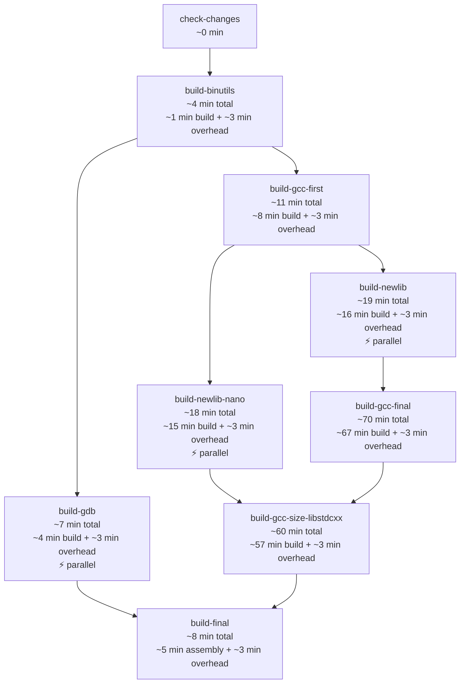

# Build Times Reference

This document records measured build times for each job in
`build-toolchain.yml`, derived from actual GitHub Actions workflow logs.
Two scenarios are covered: **cold cache** (worst case — nothing cached) and
**warm cache** (best case — all stage caches populated).

---

## Methodology

- All timings were read directly from the `started_at` / `completed_at`
  fields of individual job steps in the GitHub Actions API.
- **Build time** is the duration of the `Build stage – <name>` step (or
  `Build toolchain – final assembly` for `build-final`) only — it excludes
  runner setup, checkout, disk-space cleanup, dependency installation, and
  cache I/O.
- **Job wall-clock time** is the total duration from job start to job end,
  including all setup overhead and cache operations.
- **Runner overhead** denotes the per-job cost for checkout and setup steps.
  `build-binutils` and `build-gdb` skip free-disk-space (~45–86 s), apt
  install (~35 s), and Python venv setup (~4 s) when their stage or toolchain
  cache hits, reducing their warm-cache overhead to ~1 min (checkout +
  hash computation + cache restore only).  All other stage jobs run setup
  unconditionally and pay the full ~2–3 min overhead even on a warm cache.

### Source runs

| Scenario | Run ID | Branch | Date (UTC) |
|----------|--------|--------|------------|
| Cold cache — gcc chain | `22884303566` | merge queue (`13.3.rel1`) | 2026-03-10 |
| Cold cache — full parallel structure | `22875928379` | `copilot/parallel-newlib-build` | 2026-03-09 |
| Cold cache — confirmation | `22892923563` | `copilot/parallel-newlib-build` | 2026-03-10 |
| Warm cache — skip-setup optimisation | `23029633165` | `13.3.rel1` | 2026-03-13 |

---

## Per-stage build times (compilation only)

Pure compilation durations — the time the build script ran, excluding all
runner setup and cache I/O.

| Job | Stage | Build script | Build time (cold cache) |
|-----|-------|--------------|-------------------------|
| `build-binutils` | III-0 | `build-binutils.sh` | ~1 min |
| `build-gcc-first` | III-1 | `build-gcc-first.sh` | ~8 min |
| `build-newlib` | III-2 | `build-newlib.sh` | ~16 min |
| `build-newlib-nano` | III-3 | `build-newlib-nano.sh` | ~15 min |
| `build-gcc-final` | III-4 | `build-gcc-final.sh` | ~67 min |
| `build-gcc-size-libstdcxx` | III-5 | `build-gcc-size-libstdcxx.sh` | ~57 min |
| `build-gdb` | III-6 | `build-gdb.sh` | ~4 min |
| `build-final` | III-8–11 | `build-toolchain.sh` (pretidy/strip/specs only) | ~5 min |

> `build-newlib` and `build-newlib-nano` run in parallel (both depend only
> on `build-gcc-first`).  `build-gdb` also runs in parallel with the gcc /
> newlib chain (it depends only on `build-binutils`).
>
> `build-binutils` and `build-gdb` skip free-disk-space, apt install, and
> Python venv setup when their stage or toolchain cache hits (see
> [#296](https://github.com/grahame-org/gnu-tools-for-stm32/pull/296)).
> All other stage jobs run setup unconditionally.

---

## End-to-end wall-clock times

### Cold cache (nothing cached)

The critical path through the dependency DAG is:

**Cold cache critical-path total: ~172 min (~2 h 52 min)**

The bottleneck is the sequential gcc chain:
`binutils` → `gcc-first` → `newlib` → `gcc-final` → `gcc-size-libstdcxx` → final assembly.

Jobs that run off the critical path in parallel:

| Job | Runs in parallel with | Cold wall-clock time |
|-----|-----------------------|----------------------|
| `build-gdb` | gcc chain from `build-gcc-first` onwards | ~7 min |
| `build-newlib-nano` | `build-newlib` | ~18 min |

Both complete well before `build-gcc-final` finishes, so neither extends
the critical path.

### Warm cache (all stage caches populated)

When all per-stage caches are warm, `build-binutils` and `build-gdb` skip
their setup steps entirely and complete in ~1 min (checkout + hash
computation + cache restore only).  All other stage jobs still run setup
unconditionally and pay ~2–3 min overhead before confirming their stage
cache hits and skipping the build.

| Job | Warm-cache job time | Notes |
|-----|---------------------|-------|
| `build-binutils` | ~1 min | Setup skipped on binutils or toolchain cache hit |
| `build-gdb` | ~1 min | Setup skipped on gdb or toolchain cache hit |
| `build-gcc-first` | ~2–3 min | Setup runs unconditionally |
| `build-newlib` | ~2 min | Setup runs unconditionally |
| `build-newlib-nano` | ~2–3 min | Setup runs unconditionally |
| `build-gcc-final` | ~4–5 min | Setup runs unconditionally; cache restore takes longer |
| `build-gcc-size-libstdcxx` | ~3–4 min | Setup runs unconditionally |
| `build-final` | ~3 min | overhead + cache restores + `test_project` build |

The `test_project` cmake build and artifact comparison in `build-final`
always run regardless of cache state; both complete in under 2 s.

The warm-cache wall-clock time is dominated by the sequential
job-dependency chain — each job must wait for its predecessor before GitHub
Actions will queue it — not by any compilation work.

**Warm cache critical-path total: ~17–20 min**

The 2 min saving versus prior estimates comes from `build-binutils` now
completing in ~1 min instead of ~3 min when its stage cache hits.

> **Full toolchain cache hit:** If the assembled `toolchain` cache key also
> hits (written by `build-final` on `push` and `pull_request` events), the
> entire workflow still runs each job but every `Build stage` step is
> skipped.  Only `build-final`'s `test_project` steps still execute
> unconditionally.

---

## Summary

| Scenario | End-to-end wall-clock time |
|----------|----------------------------|
| Cold cache (no prior builds) | ~172 min (~2 h 52 min) |
| Warm cache (all stage caches hit) | ~17–20 min |

The ~8.5× speedup from caching comes almost entirely from skipping
`build-gcc-final` (~67 min) and `build-gcc-size-libstdcxx` (~57 min).
